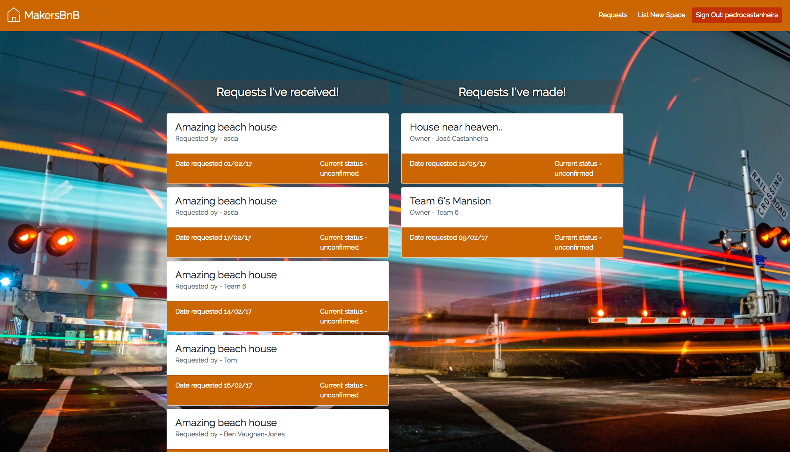
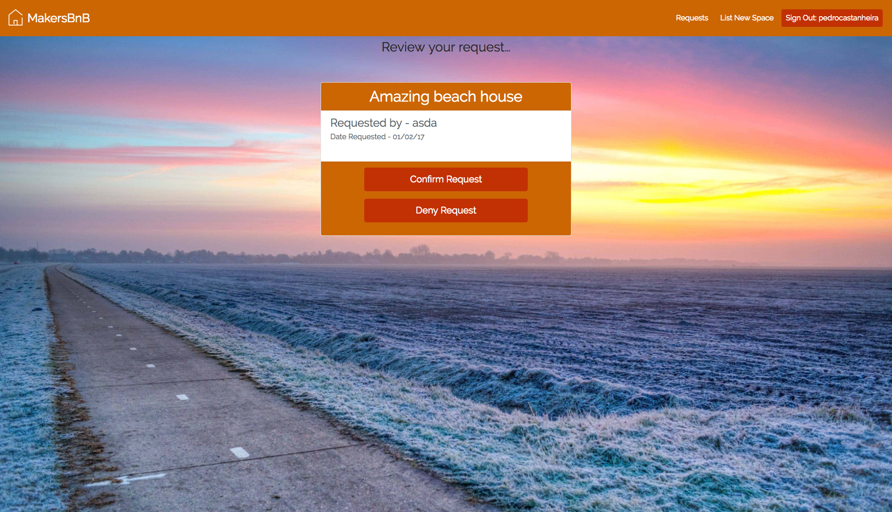

Makers BnB
===========

A practice group project based on Air BnB

## High level specifications

- Any signed-up user can list a new space.
- Users can list multiple spaces.
- Users should be able to name their space, provide a short description of the space, and a price per night.
- Users should be able to offer a range of dates where their space is available.
- Any signed-up user can request to hire any space for one night, and this should be approved by the user that owns that space.
- Nights for which a space has already been booked should not be available for users to book that space.
- Until a user has confirmed a booking request, that space can still be booked for that night.

## User Stories
```
As a user,
I want to be able to sign up for MakersBnB,
so that I can access the services of the site

As a user,
I want to be able to log into MakersBnB,
so that I can access my profile.

As a user,
I want to be able to logout from MakersBnB,
so I can protect the security of my account.

As a user,
I want to be able to list a new space,
so that I can rent it to others.

As a user,
I want to be able to see available spaces,
so that I can choose one to rent.

As a user,
I want to be able to request to hire a space,
so that I can stay there.

As a user,
I want to be able to see my received and made hire requests,
so that I can take relevant actions.

As a user,
I want to be able to approve/deny a hire request,
so that I can hire out my space.

As a user,
I want to only be able to select available dates when requesting to hire a space,
so that the space is not double booked.
```

## Setup
```
- $ git clone git@github.com:mikefieldmay/makersbnb.git
- $ gem install bundler
- $ bundler
- $ create:db makersbnb_test
- $ create:db makersbnb_development
- $ brew install phantomjs
```

## Folder structure, models and libraries
```
root
|
|----app
|     |
|     |----controllers
|     |----models
|     |----public
|     |----views
|
|----lib
|----sass
|----spec
```

## How to use

**Visit the homepage and click the sign up button**


**Fill in your details**


**You will then be able to list a space**


**You can make a request**


**You can view your requests**



**You can confirm or deny requests**



**View on mobile**


## Project management

https://tree.taiga.io/project/rkclark-makersbnb/

## Collaborators
- Mike Field-May
- Pedro Castanheira
- Rick Clark
- Ben Vaughan-Jones
